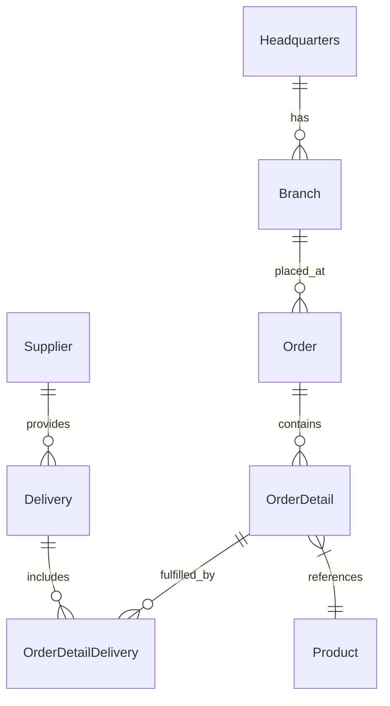

# 🚀 OctoCAT Supply: La Demostración Definitiva de GitHub Copilot v1.14.0


¡Bienvenido al Sitio Web de OctoCAT Supply - tu demostración preferida para mostrar las increíbles capacidades de GitHub Copilot, GHAS y el poder del desarrollo asistido por IA!

## ✨ Lo Que Hace Especial Esta Demostración

Esta no es solo otra aplicación de demostración - es una vitrina cuidadosamente elaborada que demuestra todo el espectro de las capacidades de IA de GitHub:

- 🤖 **Modo Agente y Visión de Copilot** - Observa cómo Copilot comprende diseños de UI e implementa características complejas en múltiples archivos
- 🎭 **Integración del Servidor MCP** - Demuestra capacidades extendidas con Playwright para pruebas e integración de la API de GitHub
- 🛡️ **Seguridad Primero** - Muestra el escaneo de GHAS y las correcciones de vulnerabilidades impulsadas por Copilot
- 🧪 **Generación de Pruebas** - Exhibe la capacidad de Copilot para analizar cobertura y generar pruebas significativas
- 🔄 **CI/CD e IaC** - Genera flujos de trabajo de despliegue y código de infraestructura con lenguaje natural
- 🎯 **Instrucciones Personalizadas** - Muestra cómo Copilot puede adaptarse para entender marcos de trabajo y estándares internos

## 🏗️ Arquitectura

La aplicación está construida usando TypeScript moderno con una separación limpia de responsabilidades:



### Stack Tecnológico
- **Frontend**: React 18+, TypeScript, Tailwind CSS, Vite
- **Backend**: Express.js, TypeScript, OpenAPI/Swagger
- **DevOps**: Docker

## 🎯 Escenarios de Demostración Clave

1. **Programación por Ambiente**
   - Implementar un carrito de compras desde un mockup de diseño
   - Observar cómo Copilot analiza, planifica e implementa en múltiples archivos
   - Mostrar actualizaciones de UI en tiempo real y gestión de estado

2. **Pruebas Automatizadas**
   - Generar archivos de características BDD
   - Crear y ejecutar pruebas de Playwright
   - Mejorar la cobertura de pruebas unitarias con generación inteligente de pruebas

3. **Seguridad y Mejores Prácticas**
   - Escanear vulnerabilidades usando GHAS
   - Generar correcciones automatizadas
   - Implementar mejores prácticas de seguridad con orientación de Copilot

4. **Automatización de DevOps**
   - Generar flujos de trabajo de GitHub Actions
   - Crear infraestructura como código
   - Configurar despliegues de contenedores

## 🚀 Comenzando

1. Clona este repositorio
2. Construye los proyectos:
   ```bash
   # Construir API y Frontend
   npm install && npm run build
   ```
3. Inicia la aplicación:
   ```bash
   npm run dev
   ```

O usa las tareas de VS Code:
- `Cmd/Ctrl + Shift + P` -> `Run Task` -> `Build All`
- Usa el panel de Debug para ejecutar `Start API & Frontend`

## 🛠️ Configuración del Servidor MCP (Opcional)

Para mostrar capacidades extendidas:

1. Instala Docker/Podman para el servidor MCP de GitHub
2. Usa la paleta de comandos de VS Code:
   - `MCP: List servers` -> `playwright` -> `Start server`
   - `MCP: List servers` -> `github` -> `Start server`
3. Configura con un PAT de GitHub (requerido para el servidor MCP de GitHub)

## 📚 Documentación

- [Arquitectura Detallada](./docs/architecture.md)
- [Script de Demostración Completo](./docs/demo-script.md)

## 🎓 Consejos Pro para Ingenieros de Soluciones

- Practica las demostraciones antes de las presentaciones a clientes
- Recuerda que Copilot es no determinístico - prepárate para adaptarte
- Mezcla y combina escenarios de demostración según tu audiencia
- Ten tu PAT de GitHub a mano para las demostraciones de MCP

---

*¡Todo este proyecto, incluyendo la imagen principal, fue creado usando IA y GitHub Copilot! Incluso este README fue generado por Copilot usando la documentación del proyecto.* 🤖✨
