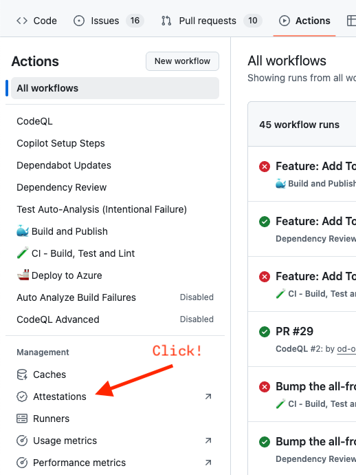
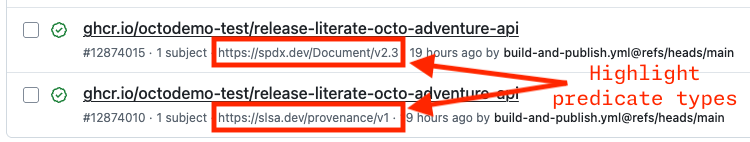
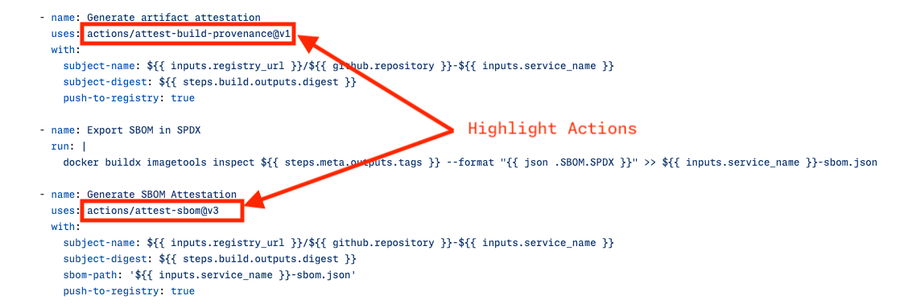
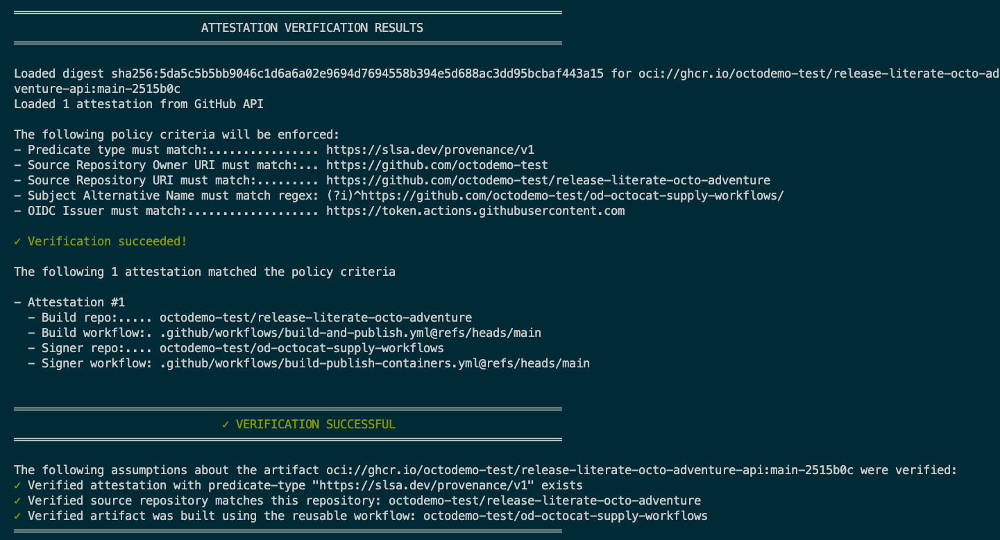

# GitHub Actions Demos

## Required Workflows

The applied ruleset, [OD OctoCAT Supply Ruleset](https://github.com/organizations/octodemo/settings/rules/8545588) (see [governance.md](./governance.md) for more information), enforces a required workflow: [Dependency Review](https://github.com/octodemo/od-octocat-supply-workflows/blob/main/.github/workflows/dependency-review.yml).

You can showcase how this works in the pull request titled `Feature: Add ToS Download`.

The required workflow lives in the repository https://github.com/octodemo/od-octocat-supply-workflows under https://github.com/octodemo/od-octocat-supply-workflows/blob/main/.github/workflows/dependency-review.yml.

You can demonstrate how required workflows can be used to enforce generalized checks, such as a dependency review. Highlight that the workflow can exist in any other repository or even within another organization of the same enterprise.

## Reusable Workflows

**What to show:** Reusing Actions workflows to streamline common CI/CD tasks across entire organizations or an enterprise.

**Why:** Demonstrate how reusable workflows can help enforce consistency, reduce duplication, and improve maintainability across multiple projects.

**How:**

1. In the demo repository, navigate to the **Actions** tab.
2. Select the [Build and Publish](../../.github/workflows/build-and-publish.yml) workflow from the left sidebar.
3. Review the workflow file to see how it references the reusable workflow from the central repository.
4. Navigate to the central repository to view the workflow: https://github.com/octodemo/od-octocat-supply-workflows/blob/main/.github/workflows/build-publish-containers.yml

## Artifact Attestations

### Creating the Attestation

**What to show:** Artifact Attestations as an integrated feature of GitHub Actions and the `gh` CLI.

**Why:** Improve security and compliance by providing verifiable, tamper-proof build metadata.

**How:**

1. In the demo repository, navigate to the **Actions** tab and select **Attestations**.
  
2. You will find at least four attestations (two each for the frontend and API). Focus on the API attestations and their distinct `predicate-types`:

    

    1. `https://spdx.dev/Document/v2.3`: Confirms an SBOM is attached. (Note: This does not validate the SBOM's contents).
    2. `https://slsa.dev/provenance/v1`: Verifies the artifact's origin, confirming it was built by a specific reusable workflow and originated from your demo repository.
3. Return to the [Build and Publish](../../.github/workflows/build-and-publish.yml) workflow (accessible via the `Workflow File` link on the attestation page).
4. Point out that this workflow uses a reusable workflow to generate attestations, and navigate to it: https://github.com/octodemo/od-octocat-supply-workflows/blob/main/.github/workflows/build-publish-containers.yml
5. In the reusable workflow, scroll to the bottom to show the simple, built-in actions that generate the attestations.
  

### Verifying the Attestation

> [!NOTE]
> The [`./demo/resources/verify-attestation.sh`](../../demo/resources/verify-attestation.sh) script provided in the demo repo automates the generation of the `gh attestation verify` command for easy demoing. It finds the latest container image and runs the appropriate `gh` command. Ensure you are authenticated with the `gh` CLI (`read:packages` scope); the script will guide you if needed.

**What to show:** Verifying artifact attestations using the `gh` CLI.

**Why:** Demonstrate a simple method to confirm an artifact's integrity before deployment.

**How:**

1. In a local checkout or Codespace, open a terminal.
2. Run the verification script:

    ```bash
    ./demo/resources/verify-attestation.sh
    ```

3. The output will show:
  
    1. The raw output from the `gh attestation verify` command.
    2. A summary explaining the verification results.

4. (Optional) If Azure deployments are configured, show how verification can be enforced in a GitHub Action:
    1. Open the deployment workflow: [.github/workflows/deploy.yml](../../.github/workflows/deploy.yml).
    2. In the `Verify Container Attestations` step, explain that it uses a local custom action.
    3. Navigate to the custom action's source: [.github/actions/verify-container-attestations/action.yml](../../.github/actions/verify-container-attestations/action.yml).
    4. The `GH_COMMAND` environment variable contains the `gh attestation verify` commands for both SLSA and SBOM checks.
    5. This action also generates a helpful job summary, which you can display by navigating to a successful workflow run.
