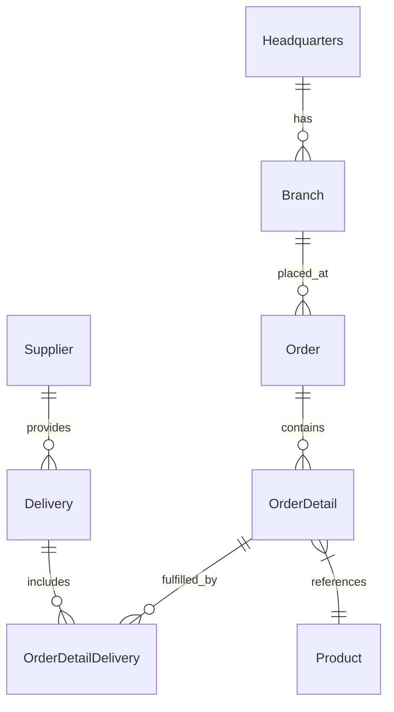
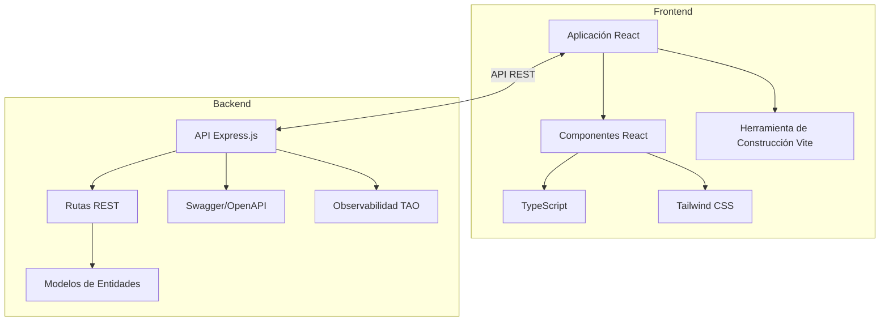

# Arquitectura del Sistema de Gestión de Cadena de Suministro OctoCAT

Este sitio es una aplicación de demostración escrita en TypeScript. Toda la aplicación fue creada originalmente a partir de un [diagrama ERD](../api/ERD.png) y prompts en lenguaje natural usando Copilot. El frontend fue creado de la misma manera, utilizando algunas de las ideas de diseño en [la carpeta de diseño](./design/).

¡La imagen principal y las imágenes de productos fueron creadas usando ChatGPT!

## Resumen de la Arquitectura

El sistema es una aplicación moderna de gestión de cadena de suministro construida usando TypeScript, que comprende una API REST backend y un frontend React. Está diseñado para demostrar las capacidades de Copilot usando una arquitectura bastante típica con un poco de complejidad, ¡pero no suficiente para descarrilar las demostraciones!

### Arquitectura del Backend
- API Express.js con endpoints RESTful para todas las entidades
- Integración de documentación Swagger/OpenAPI
- Modelos de entidades con relaciones apropiadas siguiendo un diagrama ERD

### Arquitectura del Frontend
- React 18+ con TypeScript
- Herramienta de construcción Vite para desarrollo rápido
- Tailwind CSS para estilizado de UI

### Integración DevOps
- Docker/Docker Compose para containerización

## ERD

## Arquitectura de Componentes

## Características Clave

- APIs REST completas para todas las entidades de la cadena de suministro
- Documentación detallada de OpenAPI, generada por Copilot
- UI React moderna con diseño responsivo, generada por Copilot usando imágenes
- Containerización para despliegue consistente, generado por Copilot