# Tabla de Comparación de Modelos

Esta comparación fue generada usando el archivo de prompt personalizado [model-compare.prompt.md](../.github/prompts/model-compare.prompt.md) y usando `Gemini 2.5 Pro`. Puedes generar el tuyo usando `/model-compare` en el Chat de Copilot.

> [!NOTE]
> Como el mundo de los modelos se mueve rápidamente, la información en este documento predefinido podría estar desactualizada. Usa el comando `/model-compare` como se describe arriba para obtener un archivo con la información más reciente.

## 1. Equilibrio Entre Rendimiento y Costo

**Pros:** Buenos todoterreno, versátiles, opciones costo-efectivas.

| Modelo            | Caso de Uso / Diferenciador            | GA/Preview | Habilidades Especiales | Multiplicador      |
| ----------------- | --------------------------------------- | ---------- | ---------------------- | ------------------ |
| GPT-4.1           | Por defecto para dev común, conocimiento amplio | ✅          | Multiidioma, 👓 Visual | 0 (pagado), 1 (gratis) |
| Claude 3.7 Sonnet | Desarrollo avanzado, planificación arquitectónica | ✅          | -                      | 1                  |

## 2. Soporte Rápido y de Bajo Costo para Tareas Básicas

**Pros:** Velocidad 🚀, baja latencia, ahorro de costos 💸, lógica simple, retroalimentación rápida.

| Modelo            | Caso de Uso / Diferenciador                    | GA/Preview | Habilidades Especiales | Multiplicador |
| ----------------- | ----------------------------------------------- | ---------- | --------------------- | ------------- |
| o4-mini           | Más rápido, más eficiente para tareas básicas  | 🚧          | -                     | -             |
| Claude 3.5 Sonnet | Codificación diaria, documentación, bajo costo | ✅          | -                     | 1             |
| o3-mini           | Rápido, conciso para tareas simples/repetitivas | ✅          | -                     | 0.33          |

## 3. Razonamiento Profundo y Desafíos de Codificación Complejos

**Pros:** Lógica avanzada, resolución de problemas de múltiples pasos, generación de código de alta calidad.

| Modelo         | Caso de Uso / Diferenciador                       | GA/Preview | Habilidades Especiales | Multiplicador |
| -------------- | -------------------------------------------------- | ---------- | --------------------- | ------------- |
| GPT-4.5        | Lógica multi-paso, matizada, código de alta calidad | ✅          | -                     | 50 💰          |
| o3             | Razonamiento más profundo, depuración, tareas complejas | 🚧          | -                     | -             |
| o1             | Lógica profunda, depuración, análisis de causa raíz | ✅          | -                     | 10 💰          |
| Gemini 2.5 Pro | Algoritmos avanzados, investigación de contexto largo | 🚧          | -                     | 1             |

## 4. Entradas Multimodales y Rendimiento en Tiempo Real

**Pros:** Entrada visual 👓, interacción en tiempo real, análisis de UI/diagramas.

| Modelo           | Caso de Uso / Diferenciador                        | GA/Preview | Habilidades Especiales | Multiplicador |
| ---------------- | --------------------------------------------------- | ---------- | ---------------------- | ------------- |
| GPT-4o           | Desarrollo liviano, conversacional, entrada visual | ✅          | 👓 Visual, Multiidioma | 1             |
| Gemini 2.0 Flash | Inspección de UI, análisis de diagramas, bugs visuales | ✅          | 👓 Visual              | 0.25 💸        |

---

## Referencias

- [Elegir el modelo de IA correcto para tu tarea](https://docs.github.com/en/copilot/using-github-copilot/ai-models/choosing-the-right-ai-model-for-your-task)
- [Sobre solicitudes premium](https://docs.github.com/en/enterprise-cloud@latest/copilot/managing-copilot/monitoring-usage-and-entitlements/about-premium-requests?versionId=enterprise-cloud%40latest)

---

## Resumen General de Modelos: Rendimiento vs. Calidad y Costo

```mermaid
graph LR
    %% Categoría de Rendimiento
    subgraph "Rendimiento (Más Rápido - Menor Costo/Complejidad)"
      o4m["o4-mini<br/>🚀💸<br/>(Preview)"]
      g2f["Gemini 2.0 Flash<br/>🚀💸👓<br/>(GA)"]
      o3m["o3-mini<br/>🚀💸<br/>(GA)"]
      c35s["Claude 3.5 Sonnet<br/>🚀<br/>(GA)"]
      o4m --> g2f
      g2f --> o3m
      o3m --> c35s
    end

    %% Categoría Equilibrada
    subgraph "Equilibrado"
    direction TB
    g41["GPT-4.1<br/>✅<br/>(Modelo Base)"]
    g4o["GPT-4o<br/>👓<br/>(GA)"]
    g41 --> g4o
    end

    %% Categoría de Calidad y Costo
    subgraph "Calidad y Costo (Mayor - Mayor Costo/Complejidad)"
    direction TB
    c37s["Claude 3.7 Sonnet<br/>✅<br/>(GA)"]
    g25p["Gemini 2.5 Pro<br/>🚧<br/>(Preview)"]
    o1["o1<br/>💰<br/>(GA)"]
    o3["o3<br/>🚧💰<br/>(Preview)"]
    g45["GPT-4.5<br/>✅💰💰<br/>(GA)"]
    c37s --> g25p
    g25p --> o1
    o1 --> o3
    o3 --> g45
    end

    %% Conexiones horizontales entre categorías
    c35s -.-> g41
    g4o -.-> c37s

    %% Estilos
    style o4m fill:#f9f,stroke:#333,stroke-width:2px,color:#000
    style g2f fill:#f9f,stroke:#333,stroke-width:2px,color:#000
    style o3m fill:#f9f,stroke:#333,stroke-width:2px,color:#000
    style c35s fill:#f9f,stroke:#333,stroke-width:2px,color:#000
    style g41 fill:#9cf,stroke:#333,stroke-width:2px,color:#000
    style g4o fill:#9cf,stroke:#333,stroke-width:2px,color:#000
    style c37s fill:#9fc,stroke:#333,stroke-width:2px,color:#000
    style g25p fill:#9fc,stroke:#333,stroke-width:2px,color:#000
    style o1 fill:#9fc,stroke:#333,stroke-width:2px,color:#000
    style o3 fill:#9fc,stroke:#333,stroke-width:2px,color:#000
    style g45 fill:#9fc,stroke:#333,stroke-width:2px,color:#000
```

